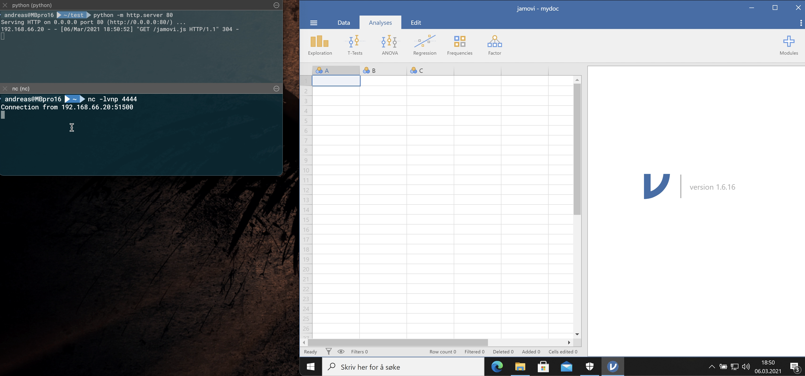

# CVE-2021-28079

## Description
When @theart42 and myself @4nqr34z, once again were looking into new software for a CTF box, we came across
an injection in Jamovi that could lead to remote code execution.

!REDACTED!

When a user opens the document, the code is executed on the local machine.

## Exploitation
!REDACTED!

Code is executed under the privilege of the user.

## Mitigation
The developer has been notified and has an update version available.
