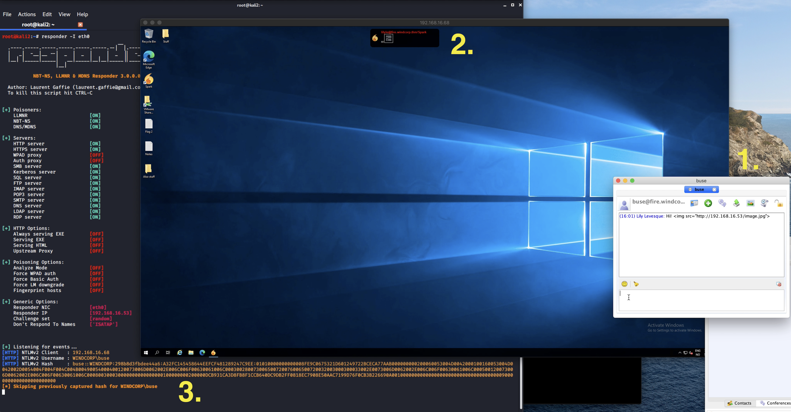

# CVE-2020-12772

## Description

When [@4nqr34z](https://twitter.com/4nqr34z) and myself, [@theart42](https://twitter.com/theart42), were building a CTF box, we came accross an interesting
vulnerability in the Spark XMPP client and its ROAR module.

When we opened a chat with another user, we could send an ``

Each time the user clicks the link, or the ROAR module automatically preloads it, the external
server receives the request for the image, together with the NTLM hashes from the user that visits
the link, i.e. the user you are chatting with!

## Exploitation
For our CTF box, this was golden. By running responder, we could capture the hashes and use them
to gain access to the user account and escalate our privileges (depending on the user of course).

## Mitigation
The developer has been notified and a fix is underway
